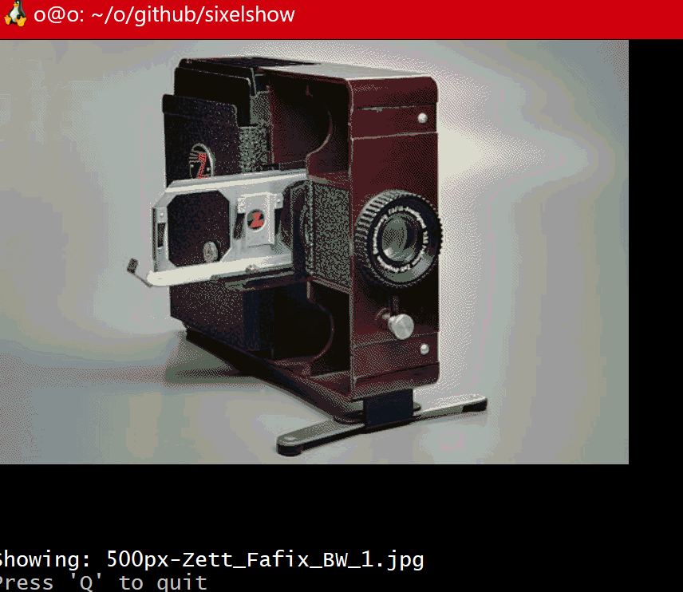

# sixelshow

how to use
linux version working with basic features
download 
> wget https://github.com/wisehackermonkey/sixelshow/releases/download/1.0.0/sixelshow -o sixelshow
>  ./sixelshow  
How to Control
← move to right image
→ move left image
q for quit

step 1 download
https://github.com/mintty/wsltty/releases
install wsltty-3.6.4-x86_64-install.exe

my case as of 2023-08-15

python3 -m venv venv_name
source venv_name/bin/activate
pip3 install pyinstaller
pyinstaller main.py --name sixelshow --onefile

